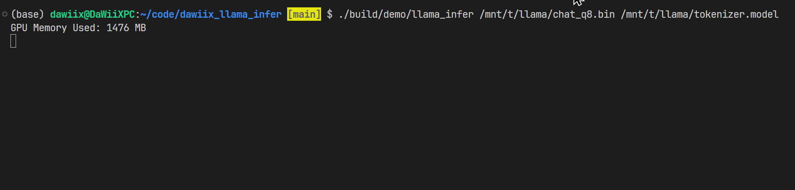

# dawiix_llama_infer

## Introduction

llama2 inference engine powerd by C++ and CUDA.


## installation

### docker(recommended)

```bash
# to be sure you have nvidia-docker2 installed
# get the base image
docker pull nvidia/cuda:11.8.0-devel-ubi8

# start the container
sudo docker run -it --gpus all --name llama2 -v {your weight path}:/weight {docker image id} /bin/bash

```
### install dependencies (use docker or not)

following ins is same wheather you use docker or not

```bash
# armadillo
wget https://jaist.dl.sourceforge.net/project/arma/armadillo-14.0.2.tar.xz
7z x armadillo-14.0.2.tar.xz
7z x armadillo-14.0.2.tar
cd armadillo-14.0.2
mkdir build
cd build/
cmake -DCMAKE_BUILD_TYPE=Release ..
make -j16
make install

# googletest
git clone https://github.com/google/googletest.git
cd googletest
mkdir build
cd build/
cmake -DCMAKE_BUILD_TYPE=Release ..
make -j16
make install

# glog
git clone https://github.com/google/glog.git
cd glog/
mkdir build
cd build/
cmake -DCMAKE_BUILD_TYPE=Release -DWITH_GFLAGS=OFF -DWITH_GTEST=OFF ..
make -j16
make install

# sentencepiece
git clone https://github.com/google/sentencepiece.git
cd sentencepiece
mkdir build
cd build/
cmake -DCMAKE_BUILD_TYPE=Release ..
make -j16
make install
```

### get the weight
you can get the weight from the offical repository [meta-llama](https://huggingface.co/collections/meta-llama/llama-2-family-661da1f90a9d678b6f55773b), [tiny-llama](https://huggingface.co/TinyLlama/TinyLlama-1.1B-Chat-v1.0/tree/main), or use `utils/export.py` to download the weight automatically and convert it to the quantized model.

### make and run it

```bash
# build the project
mkdir build
cd build/
cmake -DCMAKE_BUILD_TYPE=Release ..
make -j16

# run the demo
./build/demo/llama_infer {weight path} {tokenizer path}
# for me it is ./build/demo/llama_infer /mnt/t/llama/chat_q8.bin /mnt/t/llama/tokenizer.model
# if you dont want to use the quantailized model, you can change ./demo/main.cpp the last parameter to false.
# model::LLama2Model model(tokenizer_path, checkpoint_path, true); 
#                                                             ^
# to
# model::LLama2Model model(tokenizer_path, checkpoint_path, false);
#                                                             ^
```

## learning journey

https://zxmucttizt8.feishu.cn/wiki/IdR4wYCGoi3omekZVNacDxd8nGh?from=from_copylink

# Reproduction Progress

- [x] Unified memory resource management
  - [x] Unified CPU/CUDA device allocator
  - [x] CPU allocator
  - [x] CUDA allocator
- [x] Implementation of Tensor class
- [x] Operator registration management
- [x] Operator class
  - [x] MultiheadAttention
  - [x] SGEMV
  - [x] RMSNorm
  - [x] SwiGLU
  - [x] Others
- [x] Sampler
- [x] Weight quantization
- [x] Model Creation
- [x] Weight loading
- [x] Conversation demo

## acknowledgements

This repository is for the study and reproduction of [KuiperLlama](https://github.com/zjhellofss/KuiperLLama), thanks to the original repository author for providing such a comprehensive learning project.